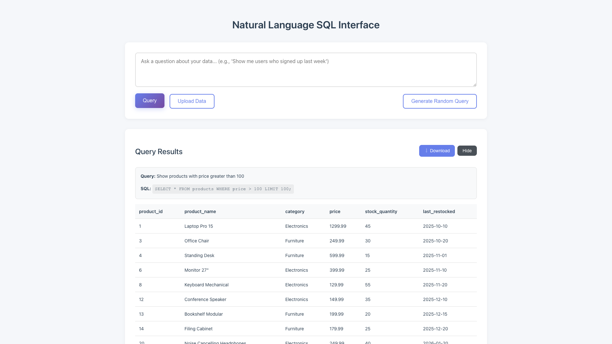

# Fix cloneNode null error on consecutive queries

**ADW ID:** d3aa734f
**Date:** 2026-01-18
**Specification:** specs/issue-5-adw-d3aa734f-sdlc_planner-fix-clonenode-null-error.md

## Overview

Fixed a critical bug where executing multiple queries in succession would crash the application with a `Cannot read properties of null (reading 'cloneNode')` error. The first query would work correctly, but subsequent queries would fail due to improper DOM manipulation of the toggle button. The fix refactors the `displayResults()` function to properly manage the actions container and toggle button across multiple query executions.

## Screenshots


*First query executes successfully and displays results*


*Second query now works without errors*


*Third query validates the fix is robust*


*Hide button works correctly after multiple queries*


*Show button restores results visibility*

## What Was Built

- Refactored toggle button and actions container management in `displayResults()`
- Created E2E test suite for consecutive query execution
- Fixed DOM manipulation to preserve element references across multiple queries
- Ensured hide/show toggle functionality works after any number of queries

## Technical Implementation

### Files Modified

- `app/client/src/main.ts`: Refactored the `displayResults()` function (lines 213-251) to fix toggle button handling
- `.claude/commands/e2e/test_consecutive_queries.md`: New E2E test to validate consecutive query execution

### Key Changes

1. **Actions Container Reuse**: Instead of destroying and recreating the actions container on each query, the code now checks if it already exists and reuses it by clearing its contents.

2. **Dynamic Toggle Button Creation**: Replaced the problematic `cloneNode()` approach with fresh button creation on each query. The original toggle button is hidden but preserved in the DOM.

3. **Eliminated DOM Replacement**: Removed the `replaceChild()` call that was permanently removing the toggle button from the DOM. The actions container is now appended once and reused.

4. **Event Listener Management**: Each query creates a new toggle button with a fresh event listener, avoiding stale references and eliminating the need for `cloneNode()` to clear old listeners.

### Root Cause

The original code had this problematic pattern:

```typescript
// This removed the element with ID from the DOM
toggleButton.parentNode?.replaceChild(actionsContainer, toggleButton);

// Second query: getElementById returns null!
const toggleButton = document.getElementById('toggle-results');
toggleButton.cloneNode(true); // Error: Cannot read properties of null
```

### Solution

The new approach:

```typescript
// First time: create and append actions container
if (!actionsContainer) {
  actionsContainer = document.createElement('div');
  actionsContainer.className = 'results-actions';
  resultsHeader.appendChild(actionsContainer);
}

// Every time: clear and rebuild buttons
actionsContainer.innerHTML = '';
const toggleButton = document.createElement('button');
// ... add functionality
actionsContainer.appendChild(toggleButton);
```

## How to Use

The bug fix is transparent to end users. The application now works as expected:

1. Load sample data (e.g., "Product Inventory")
2. Enter a natural language query (e.g., "Show all products")
3. Click Query button - results display
4. Enter another query (e.g., "Show products with price greater than 50")
5. Click Query button again - results update correctly without errors
6. Repeat as many times as needed
7. Use Hide/Show toggle button to collapse/expand results

## Configuration

No configuration changes required. The fix is applied automatically.

## Testing

### E2E Test

Run the comprehensive E2E test for consecutive queries:

```bash
# Read the test runner instructions
cat .claude/commands/test_e2e.md

# Execute the consecutive queries test
cat .claude/commands/e2e/test_consecutive_queries.md
# (Follow the test steps using Playwright MCP tools)
```

The test validates:
- Three consecutive queries execute without errors
- Results display correctly for each query
- Hide/Show toggle works after multiple queries
- Download button appears when results are present

### Manual Testing

1. Start the dev server: `cd app/server && uv run uvicorn app.main:app --reload`
2. Navigate to http://localhost:5173
3. Execute multiple queries in succession
4. Verify no console errors
5. Test toggle button functionality

### Validation Commands

All validation commands passed:

```bash
cd app/server && uv run pytest                    # Server tests pass
cd app/client && bun tsc --noEmit                 # No type errors
cd app/client && bun run build                    # Build succeeds
# E2E test for consecutive queries passes
```

## Notes

- The original `#toggle-results` button in `index.html` is preserved but hidden (`display: none`) to maintain backward compatibility
- The fix uses `innerHTML = ''` to clear the actions container, which automatically removes old event listeners
- Download button only appears when query results are present (not for errors or empty results)
- The solution is minimal and surgical - only the necessary code was changed
- Future enhancements could further optimize by avoiding button recreation, but the current approach is simple and reliable